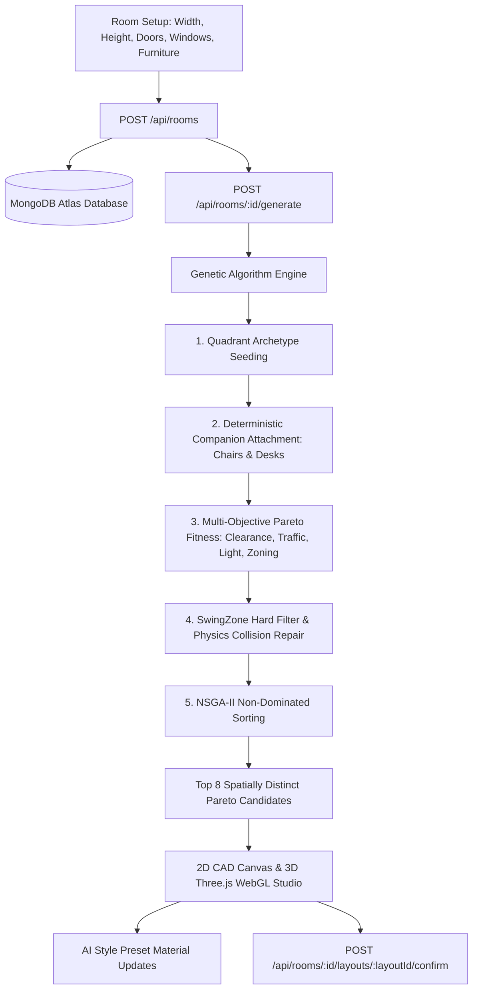

# 🏛️ RoomCraft — Architectural AI Studio
### Intelligent 2D CAD Floorplanning & 3D Interactive BIM Interior Design

[](https://react.dev/)
[](https://threejs.org/)
[](https://nodejs.org/)
[](https://www.mongodb.com/)
[](https://vitejs.dev/)
[](LICENSE)

**RoomCraft** is an intelligent, full-stack architectural design studio and spatial optimization platform. Powered by **Multi-Objective Genetic Algorithms (NSGA-II)**, RoomCraft automatically computes, arranges, and presents ergonomic, code-compliant, and aesthetically balanced interior layouts across **2D CAD Blueprints** and **Interactive 3D WebGL Environments**.

---

## 🌟 Key Highlights & Architectural Features

### 1. 🧬 Multi-Objective Genetic Algorithm Engine (NSGA-II)
Rather than flattening layout quality into an arbitrary single score, RoomCraft evaluates spatial arrangements across four independent objective functions and returns a diverse **Pareto Optimal Frontier**:
* **Clearance & Wall Alignment ($f_1$ — 20%)**: Enforces zero furniture overlap, $70\text{ cm}$ entryway clearance, $60\text{ cm}$ passage halos, and flush wall anchoring.
* **Circulation & Traffic Flow ($f_2$ — 20%)**: Raycasts $90\text{ cm}$ wide circulation corridors between room entry doors and central movement nodes.
* **Natural Daylight Alignment ($f_3$ — 20%)**: Directs daylight toward desks and seating while shielding glare-sensitive entertainment screens.
* **Composite Zone Score ($f_4$ — 40%)**:
  $$\text{ZoneScore} = (\text{IntraClusterAffinity} \times 0.5) + (\text{InterZoneSeparation} \times 0.5)$$
  Balances complementary pairings (Bed $\leftrightarrow$ Nightstand, Desk $\leftrightarrow$ Chair, Table $\leftrightarrow$ Chairs) with minimum spatial separation constraints between incompatible functional zones (`Sleep` $\leftrightarrow$ `Lounge`: $150\text{ cm}$, `Work` $\leftrightarrow$ `Lounge`: $120\text{ cm}$).

---

### 2. 📐 RoomCraft Optimization Rules (v2)
* **Corner Swing-Arc Physical Volume (`SwingZone`)**: Treats wardrobe doors as 3D clearance boxes ($65\text{ cm}$ depth) and enforces $\ge 65\text{ cm}$ corner clearance from perpendicular walls. Blocked storage swings trigger an immediate hard-filter disqualification ($f_{\text{clearance}} \le 0.01$).
* **Deterministic Dining Table & Chair Synthesis**: Removes chairs from random chromosome drift; chairs are computed deterministically around table edges with $\ge 60\text{ cm}$ clearance, symmetrical 2/4/6 allocations, long-edge 1/3 and 2/3 positions, and $15\text{ cm}$ under-table tucking.
* **Deterministic Office Desk & Chair Pairing**: Office chairs automatically sit on the open user side of the desk, facing the workspace and tucked $15\text{ cm}$ under the desk surface.
* **TV Line-of-Sight Corridor**: Aligns TV stands opposite sofas or beds with strict line-of-sight protection—no tall furniture (wardrobes, dining sets, desks) can obstruct the viewing corridor.
* **Architectural Area Rugs & Carpets**: Real-time rendering of cozy area rugs under beds ($+70\text{ cm} \times +50\text{ cm}$) and sofas in both 2D blueprints and 3D scenes.
* **Collision-Free Dynamic Wall Shelves**: Shelves dynamically validate wall clearance against doors ($\pm 70\text{ cm}$), windows ($\pm 75\text{ cm}$), TV stands, and tall wardrobes before mounting.

---

### 3. 🎨 AI Architectural Style Recommendations Studio
Switch between curated design presets with live Three.js WebGL material synchronization:
* 🌿 **Scandinavian Modern**: Nordic White, White Oak, Sage Green, Cashmere Linen, Light Oak Parquet flooring.
* 🏙️ **Industrial Loft**: Urban Concrete, Dark Slate, Aged Cognac Leather, Reclaimed Dark Walnut, Polished Dark Slate flooring.
* 🤍 **Minimalist Sanctuary**: Gallery White, Bleached Ash, Stone Greige, Satin Chrome, Bleached Ash wood flooring.
* 🍵 **Japandi Warmth**: Washi Beige, Natural Bamboo, Terracotta Clay, Smoked Hinoki Cypress flooring.

---

### 4. 🖥️ Interactive 2D Blueprint & 3D BIM Studio
* **2D CAD Blueprint (`RoomCanvas.jsx`)**: Scaled architectural canvas with a $50\text{ cm}$ CAD grid, door swing arcs, reflective sky-blue windows, sunlight projection polygons, traffic flow rays, and clearance halos. Supports drag-and-drop repositioning, rotation, and high-resolution **PNG CAD Export**.
* **Interactive 3D BIM Studio (`Room3DView.jsx`)**: Powered by Three.js with `PCFShadowMap` soft shadows, camera orbit/pan/zoom controls, top-down orthogonal switch, daylight vs. evening warm lighting, and **Dynamic 4-Wall Culling** (walls facing the camera automatically become translucent so you never lose sight of your room).
* **Dual-Docked Sticky Command Toolbar**: Smooth scrolling toolbar keeping 2D/3D toggles and the AI Style Studio pinned beneath the header at all times.

---

## 🏗️ System Architecture & Data Flow



---

## 📂 Repository Structure

```
RoomCraft/
├── client/                     # React 19 Frontend (Vite)
│   ├── public/                 # Static web assets
│   ├── src/
│   │   ├── components/         # RoomCanvas, Room3DView, StyleModal, Navbar
│   │   ├── data/               # stylePresets.json (AI Design Themes)
│   │   ├── pages/              # Home, RoomSetup, LayoutView
│   │   ├── services/           # room.js (API client with VITE_API_URL)
│   │   ├── index.css           # Vanilla CSS architectural design system
│   │   └── main.jsx            # Application entry point & router
│   ├── package.json
│   ├── vercel.json             # SPA fallback configuration for Vercel
│   └── vite.config.js
│
├── server/                     # Node.js / Express Backend
│   ├── src/
│   │   ├── ga/                 # Genetic Algorithm & Spatial Geometry
│   │   │   ├── diningChairs.js # Deterministic dining & office chairs
│   │   │   ├── fitness.js      # Multi-objective Pareto scoring (v2)
│   │   │   ├── mutation.js     # Physics push vectors & overlap repair
│   │   │   ├── pareto.js       # Non-dominated Pareto frontier
│   │   │   ├── population.js   # Functional quadrant archetype seeding
│   │   │   ├── runGA.js        # GA orchestrator & candidate diversity
│   │   │   ├── swingZone.js    # Corner swing-arc physical volume checks
│   │   │   └── zoning.js       # Functional zoning & compatibility matrix
│   │   ├── models/             # Mongoose Schemas (Room, GeneratedLayout)
│   │   ├── routes/             # RESTful endpoints (/api/rooms)
│   │   └── server.js           # Express app & MongoDB connection
│   ├── package.json
│   └── .env.example            # Backend environment variable template
│
├── furnitureCatalog.json       # Dimensions, categories, & tags catalog
├── ROOMCRAFT_A_TO_Z_COMPREHENSIVE_GUIDE.md # Complete architectural handbook
└── README.md
```

---

## 💻 Local Development Setup

### Prerequisites
* **Node.js**: v18.0.0 or higher
* **MongoDB**: Local MongoDB instance or free cloud cluster on [MongoDB Atlas](https://www.mongodb.com/atlas)

### 1. Clone the Repository
```bash
git clone https://github.com/reetshrivastav/roomcraft.git
cd roomcraft
```

### 2. Backend Server Setup
```bash
cd server
npm install

# Create your .env file from the example
cp .env.example .env
```
Edit `server/.env` with your MongoDB connection string and desired port:
```env
PORT=5000
MONGO_URI=mongodb+srv://<username>:<password>@cluster0.mongodb.net/roomcraft?retryWrites=true&w=majority
```
Start the server:
```bash
npm run dev
# Server starts on http://localhost:5000
```

### 3. Frontend Client Setup
In a new terminal window:
```bash
cd client
npm install

# Optional: customize .env (defaults to http://localhost:5000)
cp .env.example .env

npm run dev
# Application opens on http://localhost:5173
```

---

## 🚀 Production Cloud Deployment Guide

### A. Database Deployment (MongoDB Atlas)
1. Log in to [MongoDB Atlas](https://www.mongodb.com/atlas) and create a free M0 cluster.
2. In **Database Access**, create a user with read/write privileges.
3. In **Network Access**, add `0.0.0.0/0` (allow access from anywhere) so cloud hosts like Render can connect.
4. Click **Connect** → **Drivers** and copy your connection string (`MONGO_URI`).

---

### B. Backend Deployment (Render or Railway)

#### Deploying on [Render](https://render.com/):
1. Create a new **Web Service** and connect your GitHub repository `reetshrivastav/roomcraft`.
2. Configure settings:
   * **Root Directory**: `server`
   * **Environment**: `Node`
   * **Build Command**: `npm install`
   * **Start Command**: `npm start`
3. In **Environment Variables**, add:
   * `MONGO_URI`: Your MongoDB Atlas connection string.
   * `PORT`: `5000` (or leave default).
4. Deploy! Your backend API will be live at `https://<your-service-name>.onrender.com`.

---

### C. Frontend Deployment (Vercel)

#### Deploying on [Vercel](https://vercel.com/):
1. Log in to Vercel, click **Add New** → **Project**, and select your GitHub repository.
2. Configure settings:
   * **Framework Preset**: `Vite`
   * **Root Directory**: `client`
   * **Build Command**: `npm run build`
   * **Output Directory**: `dist`
3. Under **Environment Variables**, add:
   * `VITE_API_URL`: Your deployed backend URL (e.g. `https://<your-service-name>.onrender.com`).
4. Click **Deploy**!
   *(SPA client-side routing is handled automatically via [client/vercel.json](client/vercel.json)).*

---

## 📜 Shared Spatial Data Contract

All dimensions and coordinates adhere to the unified coordinate space:
* **Units**: Centimeters ($\text{cm}$)
* **Coordinate Origin**: Top-left corner `(0, 0)` with positive X rightward and positive Y downward.
* **Rotations**: Orthogonal angles only: $0^\circ$ (North), $90^\circ$ (East), $180^\circ$ (South), $270^\circ$ (West).
* **Furniture Reference**: Defined in [furnitureCatalog.json](furnitureCatalog.json) with physical bounding boxes, categories, and tags (`must-be-near-wall`, `pair-with`).

---

## 🤝 Contributing & License
Contributions are welcome! Please open an issue or submit a Pull Request.

Released under the **ISC License**. Built with ❤️ for architects, interior designers, and homeowners.
