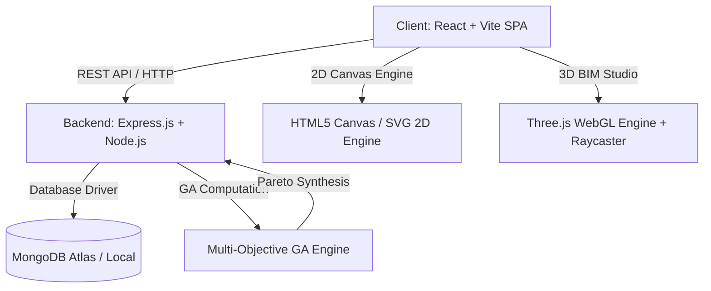
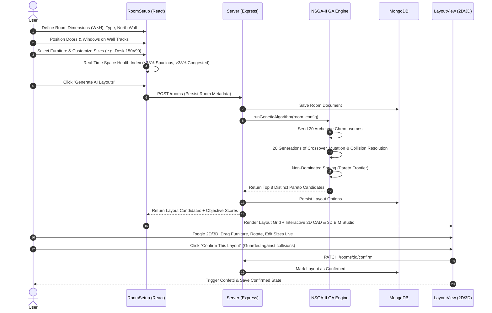

# 🏛️ RoomCraft: A-to-Z Comprehensive Master Guide

---

## 📑 Table of Contents
1. [Executive Summary & Problem Statement](#1-executive-summary--problem-statement)
2. [High-Level Architecture & Tech Stack](#2-high-level-architecture--tech-stack)
3. [End-to-End System & User Flow](#3-end-to-end-system--user-flow)
4. [Genetic Algorithm & Spatial Optimization Engine](#4-genetic-algorithm--spatial-optimization-engine)
5. [Interior Design & Ergonomic Placement Rules](#5-interior-design--ergonomic-placement-rules)
6. [Interactive 2D Blueprint & 3D BIM Studio Engine](#6-interactive-2d-blueprint--3d-bim-studio-engine)
7. [Data Models, Schemas & API Specifications](#7-data-models-schemas--api-specifications)
8. [Skills, Concepts & Technologies Mastered](#8-skills-concepts--technologies-mastered)
9. [Directory Structure & Module Breakdown](#9-directory-structure--module-breakdown)
10. [Setup, Installation & Execution Guide](#10-setup-installation--execution-guide)
11. [Future Roadmap & Potential Extensions](#11-future-roadmap--potential-extensions)

---

## 1. Executive Summary & Problem Statement

### The Problem
Arranging furniture in residential and commercial spaces is a complex combinatorial optimization problem. Traditional manual layout planning suffers from:
- **Spatial congestion & blind-spot collisions**: Placing furniture without considering door swings, window light glare, or natural walking paths.
- **Ergonomic inefficiencies**: Placing chairs facing away from desks/tables, wardrobes facing walls, or beds blocking access corridors.
- **Lack of accessible 3D visualization**: Most CAD tools are either overly basic (static 2D boxes) or prohibitively complex enterprise BIM suites (Revit, AutoCAD).

### The Solution: RoomCraft
**RoomCraft** is an AI-powered architectural spatial planning studio that automates interior layout generation using a **Multi-Objective Non-Dominated Sorting Genetic Algorithm (NSGA-II)**. It calculates Pareto-optimal arrangements optimized for:
- 🚪 **Traffic Flow & Primary Entry Walkways**
- 🛡️ **Zero Collisions, Wall Alignment & Door Swing Clearance**
- ☀️ **Natural Window Daylight Exposure & Screen Glare Shielding**
- 🛋️ **Functional Companion Clustering & Breathing Room**

Users can customize dimensions, drag-and-drop elements in both **2D CAD View** and **3D Interactive Studio**, simulate sunlight angles, and export production-ready PNG blueprints.

---

## 2. High-Level Architecture & Tech Stack



### Technology Matrix

| Layer | Technologies Used | Purpose |
| :--- | :--- | :--- |
| **Frontend UI / UX** | React 18, Vite, Vanilla CSS Design System, Lucide React, Canvas-Confetti | Responsive UI, Coohom-inspired warm cream aesthetic, micro-interactions |
| **3D Rendering** | Three.js (WebGL), OrbitControls, Raycasting, Custom Mesh Materials | 3D room visualization, 4-wall camera culling, 3D drag-and-drop |
| **2D CAD Engine** | React SVG/HTML5 Canvas, Dynamic Scaling, Raycast Sunlight | 2D dimensioned floorplans, traffic flow overlays, clearance halos |
| **Backend & Routing**| Node.js, Express.js, CORS, Dotenvx | REST API endpoints for rooms, layouts, and mutation pipelines |
| **Database** | MongoDB, Mongoose ORM | Persistent storage for room geometry, custom dimensions, and layouts |
| **Spatial Optimization** | Custom JavaScript NSGA-II GA Engine | Multi-objective Pareto optimization, collision resolution, vector math |
| **Export Engine** | html2canvas | High-res architectural PNG blueprint export |

---

## 3. End-to-End System & User Flow



---

## 4. Genetic Algorithm & Spatial Optimization Engine

The core spatial engine is implemented in `server/src/ga/`:

### 4.1 Chromosome Representation
A **Chromosome** is an array of **Genes**, where each gene represents one placed furniture item:
```javascript
{
  furnitureId: "sofa",  // Catalog item ID
  x: 120,               // Top-left X coordinate in cm
  y: 2,                 // Top-left Y coordinate in cm
  rotation: 180         // 0°, 90°, 180°, or 270°
}
```

### 4.2 Initial Population & Archetype Diversity (`population.js` & `zoning.js`)
Rather than starting from random placements that yield poor results, RoomCraft seeds the initial population with **Interior Design Archetypes & Functional Quadrants**:
- **Quadrant-Based Zone Seeding**: Assigns functional zones (`Sleep`, `Work`, `Dine`, `Lounge`) to room quadrants (NW, NE, SE, SW). Compatible zones (`Sleep` + `Work`) share quadrants; incompatible zones (`Sleep` $\leftrightarrow$ `Lounge`) occupy diagonally opposite quadrants.
- **Corner Swing-Arc Validation (`SwingZone`)**: Physical volume check ($\text{width} \times 65\text{ cm}$ depth) enforces $\ge 65\text{ cm}$ corner clearance from perpendicular walls so wardrobes can open freely.
- **Deterministic Dining Chair Synthesis**: Dining chairs are removed from the chromosome genes to prevent random floating drift. They are computed deterministically around the dining table based on 4-edge clearances ($\ge 60\text{ cm}$) with symmetric tuck-in.

### 4.3 Multi-Objective Evaluation & Optimization Rules v2 (`fitness.js`)
Four fitness functions evaluate every chromosome independently with updated architectural weights:

$$\text{Clearance Score} = (S \times 0.15) + (D \times 0.30) + (W \times 0.25) + (B \times 0.30)$$

1. **Clearance & Wall Alignment ($f_1$ — 20%)**:
   - $S$ (Spacing): Minimum $60\text{ cm}$ clearance between unrelated items.
   - $D$ (Doorways): Zero tolerance for blocking entryways.
   - $W$ (Wall Proximity): Full score for storage/beds placed within $15\text{ cm}$ of walls.
   - $B$ (Breathing Room): Penalizes large items blocking the inner $30\%\text{--}70\%$ room core.
   - **Hard Filter**: Any blocked storage swing zone drops clearance to $\le 0.01$ (Pareto disqualification).
2. **Traffic Flow ($f_2$ — 20%)**:
   - Raycasts $90\text{ cm}$ wide primary corridors between entry doors and the room center.
   - Direct doorway obstruction drops score to $0.001$.
3. **Natural Daylight Exposure ($f_3$ — 20%)**:
   - Evaluates distance and orientation to windows. Desks/tables score high near windows; TVs/wardrobes avoid window glare.
4. **Composite Zone Score ($f_4$ — 40%)**:
   $$\text{ZoneScore} = (\text{IntraClusterAffinity} \times 0.5) + (\text{InterZoneSeparation} \times 0.5)$$
   - **IntraClusterAffinity**: Rewards pairing of complementary pieces (Bed $\leftrightarrow$ Nightstand, Sofa $\leftrightarrow$ Media, Desk $\leftrightarrow$ Chair, Table $\leftrightarrow$ Chairs).
   - **InterZoneSeparation**: Enforces zone compatibility matrix (Sleep $\leftrightarrow$ Lounge: $150\text{ cm}$, Work $\leftrightarrow$ Lounge: $120\text{ cm}$, Sleep $\leftrightarrow$ Dine: $80\text{ cm}$, Sleep $\leftrightarrow$ Work: compatible).

### 4.4 Mutation & Collision Repair (`mutation.js`)
- **Independent Gene Mutation**: Mutates only tables, desks, beds, and sofas; dining chairs follow deterministically.
- **SwingZone Protection**: Collision resolution prevents items from entering storage swing volumes or clipping corners within $65\text{ cm}$.
- **Multi-Pass Collision Resolution**: Physics push vectors separate overlapping items while preserving $-15\text{ cm}$ chair under-table tucking.

### 4.5 Pareto Front Synthesis (`runGA.js`)
Uses **Non-Dominated Sorting (NSGA-II)** with candidate diversity selection:
- Selects the top 8 spatially distinct non-dominated candidates.
- Automatically attaches deterministic dining chairs to each candidate before delivering to the client.

---

## 5. Interior Design & Ergonomic Placement Rules (v2)

| Component | Rule Implementation | Ergonomic / Spatial Rationale |
| :--- | :--- | :--- |
| **Door Clearance** | $80\text{ cm}$ door width + $90\text{ cm}$ front entry corridor exclusion zone. | Strict exclusion zone; direct doorway blockage immediately triggers near-zero fitness disqualification. |
| **Wardrobe Door Swing** | Physical volume `SwingZone` ($65\text{ cm}$ depth) + $\ge 65\text{ cm}$ corner clearance. | Ensures wardrobe doors open completely without colliding with perpendicular walls or adjacent furniture. |
| **Dining Table & Chairs** | Deterministic seat allocation; $\ge 60\text{ cm}$ edge clearance; $15\text{--}20\text{ cm}$ tuck-in. | Unfitted chairs are removed rather than scattered across the room; 2 chairs on long edges, 4 chairs at 1/3 and 2/3 marks, 6 chairs with end seats. |
| **Functional Zoning** | Compatibility matrix: Sleep $\leftrightarrow$ Lounge ($150\text{ cm}$ min), Work $\leftrightarrow$ Lounge ($120\text{ cm}$ min). | Prevents incompatible spaces from clashing while allowing compatible zones (Sleep + Work) to share space. |
| **Office Desk & Chair** | Deterministic synthesis; chair faces into desk; tucked $15\text{ cm}$ under desk. | Eliminates random floor drift; places office chair on user side facing desk workspace. |
| **TV Viewing Corridor** | TV faces sofa (or bed); line of sight strictly clear except small coffee table. | Viewing corridor protection in GA prevents blocking sightlines with wardrobes, tables, or desks. |
| **Architectural Rugs** | Procedural woven rugs under bed ($+70\text{ cm} \times +50\text{ cm}$) and sofa/coffee table. | Defined cozy zones styled dynamically by active AI Style Preset (Nordic, Industrial, Minimalist, Japandi). |
| **Wall Display Shelves** | Dynamic collision validation; mounts only on wall segments clear of doors, windows, and TV. | Completely avoids clashing floating decor with doors, TV backboards, or wardrobe units. |
| **Sofa & TV Pairing** | TV targets opposite wall, centered on sofa viewing vector. Coffee table sits $45\text{ cm}$ in front. | Optimal focal distance for entertainment viewing without obstruction. |
| **Bed & Nightstands** | Headboard to wall; nightstands placed $6\text{ cm}$ flanking left and right sides. | Standard architectural bedroom master suite layout. |
| **Space Health Index** | Floor area coverage $<28\%$ = 🟢 Spacious, $28\%\text{--}38\%$ = 🟡 Comfortable, $>38\%$ = 🔴 Congested. | Alerts user when furniture exceeds comfortable movement thresholds. |
| **Duplicate Item Naming** | Multiples of same item dynamically labeled `Wardrobe 1`, `Wardrobe 2`, `Dining Chair 1`..`4`. | Prevents naming confusion across 2D blueprints and 3D studios. |

---

## 6. Interactive 2D Blueprint & 3D BIM Studio Engine

### 2D CAD Blueprint (`RoomCanvas.jsx`)
- **Dynamic Canvas Scaling**: Automatically calculates scale factor based on container dimensions while preserving exact aspect ratio.
- **Directional Backrest Indicators**: Colored border strips indicate which side of an item is the back panel.
- **Interactive Layers**:
  - 📏 50 cm CAD grid background.
  - 🚪 Brown door blocks with swing radius arcs.
  - 🪟 Sky-blue reflective windows (`#38bdf8`) with diagonal glare sheen.
  - ☀️ Window sunlight projection polygons.
  - 👣 Traffic corridor raycast trails.
  - 🛡️ $60\text{ cm}$ dashed clearance halos.

### 3D Interactive BIM Studio (`Room3DView.jsx`)
- **Engine**: Three.js WebGL with `PCFShadowMap` soft lighting.
- **Dynamic 4-Wall Culling**: Raycasts camera vector to wall normal vectors. Walls between the camera and the room interior automatically become semi-transparent ($15\%$ opacity), preventing view blockage while keeping the room enclosed.
- **Raycaster Drag-and-Drop**: Users can click and drag 3D furniture models along the 3D floor plane in real time.
- **Lighting Engine**:
  - **Daylight Mode**: Warm white ambient + directional sun aligned with North wall.
  - **Evening Mode**: Warm golden ambient (`#fef3c7`) + soft shadows.
- **Realistic 3D Meshes**:
  - Hardwood oak parquet flooring with procedural grain canvas texture.
  - Beds with mattress, headboard, layered duvet, and pillows.
  - Wardrobes with brass door handles and panel trim.
  - Desks with monitors, keyboards, and ergonomic chairs.
  - Glass windows with physical reflectivity (`MeshPhysicalMaterial`) and white architectural mullions.
  - Potted houseplants and wall display shelves for aesthetic realism.

### 6.3 AI Style Recommendations Studio (`StyleModal.jsx` & `stylePresets.json`)
- **Architectural Presets**:
  - **Scandinavian Modern**: Nordic White (`#faf7f2`), White Oak (`#c8ad8d`), Sage Green (`#647c64`), Cashmere Linen (`#e6e2db`), Light Oak Parquet flooring.
  - **Industrial Loft**: Urban Concrete (`#ded9d2`), Dark Slate (`#3a3d40`), Aged Cognac Leather (`#92522c`), Reclaimed Dark Walnut (`#4a3325`), Raw Steel accents.
  - **Minimalist Sanctuary**: Gallery White (`#fcfcff`), Bleached Ash (`#dcd3c5`), Stone Greige (`#e8e4dc`), Satin Chrome (`#a8abb0`), Seamless Bleached Ash wood flooring.
  - **Japandi Warmth**: Washi Beige (`#f5f0e8`), Natural Bamboo (`#d4be9c`), Terracotta Clay (`#c27a5b`), Smoked Hinoki Cypress flooring.
- **Dynamic 3D Material Binding**:
  - Automatically updates Three.js standard materials (`floorMat`, `wallOpaqueMat`, `oakMat`, `fabricCreamMat`, `leatherBrownMat`).
- **AI Matching Furniture Sets**:
  - Curates matching living consoles, dining sets, and bedroom suites tailored to the selected theme.
- **Architectural Styling Guidelines**:
  - Actionable designer recommendations for lighting color temperature (2700K vs. diffuse ambient), negative space, and material contrasts.

---

## 7. Data Models, Schemas & API Specifications

### 7.1 Room Model Schema (`server/src/models/Room.js`)
```javascript
{
  userId: { type: String, required: true },
  name: { type: String, default: "My Room" },
  roomType: { type: String, enum: ["bedroom", "living", "office", "dining", "studio"], default: "bedroom" },
  width: { type: Number, required: true, min: 1 },    // cm
  height: { type: Number, required: true, min: 1 },   // cm
  northFacing: { type: String, enum: ["top", "right", "bottom", "left"], default: "top" },
  doors: [{
    wall: { type: String, enum: ["top", "right", "bottom", "left"] },
    x: Number,
    y: Number
  }],
  windows: [{
    wall: { type: String, enum: ["top", "right", "bottom", "left"] },
    x: Number,
    y: Number
  }],
  furnitureSelection: [String],
  customDimensions: { type: mongoose.Schema.Types.Mixed, default: {} },
  selectedLayoutId: { type: String, default: null }
}
```

### 7.2 REST API Endpoints

| Method | Endpoint | Description |
| :--- | :--- | :--- |
| `POST` | `/rooms` or `/api/rooms` | Creates a new room configuration. |
| `GET` | `/rooms/:id` | Fetches room metadata by ID. |
| `POST` | `/rooms/:id/generate` | Runs the GA engine and generates 8 distinct Pareto layouts. |
| `GET` | `/rooms/:id/layouts` | Retrieves all generated layout candidates for a room. |
| `PATCH`| `/rooms/:id/confirm` | Confirms and saves the user-selected layout ID. |

---

## 8. Skills, Concepts & Technologies Mastered

By building and engineering RoomCraft, the following core engineering skills were developed:

### 1. Advanced Algorithm Design & Optimization
- **Multi-Objective Genetic Algorithms (NSGA-II)**: Chromosome encoding, crossover, position mutation, non-dominated Pareto sorting, and crowding distance.
- **Computational Geometry & Raycasting**: 2D/3D polygon intersection, line-corridor raycasting for traffic flow, point-in-polygon math, and spatial boundary clamping.
- **Heuristic Physics & Collision Resolution**: Multi-pass displacement vectors, under-table chair tucking tolerance, and boundary clearance algorithms.

### 2. 3D Web Graphics & WebGL Engineering (Three.js)
- **Scene Graph Architecture**: Nested object groups, hierarchical local/world coordinate transforms, and dynamic camera projection.
- **Interactive Raycasting & Unprojection**: Converting screen pixel mouse events into 3D floor plane coordinates for drag-and-drop.
- **Shaders & Physical Materials**: `MeshPhysicalMaterial` with transmission, clearcoat, roughness, IOR (Index of Refraction), and procedural canvas texture generation.
- **Dynamic Camera Wall Culling**: Calculating dot products between camera gaze vectors and wall plane normals for automatic transparency.

### 3. Full-Stack Web Application Architecture
- **MERN Stack**: Modern React 18 frontend with an asynchronous Node.js Express REST API backend and MongoDB persistence.
- **Schema Design & Sanitization**: Handling flexible polymorphic objects (`customDimensions`) without triggering Mongoose subdocument validation crashes.
- **State Synchronization**: Bidirectional synchronization between 2D canvas coordinates, 3D scene groups, and floating editor state.

### 4. UI/UX & Design Systems
- **Modern Interior Studio Aesthetics**: Warm cream and terracotta palette inspired by tools like Coohom, glassmorphic panels, and smooth micro-animations.
- **Space Health Ergonomics**: Real-time feedback meters, directional backrest indicators, and interactive export utilities.

---

## 9. Directory Structure & Module Breakdown

```
RoomCraft/
├── client/                               # Frontend React + Vite SPA
│   ├── src/
│   │   ├── components/
│   │   │   ├── Navbar.jsx                # Global navigation & branding
│   │   │   ├── RoomCanvas.jsx            # 2D CAD Blueprint with scale, light rays & paths
│   │   │   ├── Room3DView.jsx            # Three.js 3D Studio (drag & drop, 4-wall culling)
│   │   │   └── ScoreBreakdown.jsx        # Radar / Progress metrics for 4 GA objectives
│   │   ├── pages/
│   │   │   ├── Home.jsx                  # Landing page & quick-start templates
│   │   │   ├── RoomSetup.jsx             # Room creation, door/window tracks, furniture picker
│   │   │   └── LayoutView.jsx            # 8-Option Pareto viewer, floating furniture studio
│   │   ├── services/
│   │   │   └── room.js                   # REST API client endpoints
│   │   ├── utils/
│   │   │   └── validateRoom.js           # Client-side boundary validation
│   │   ├── furnitureCatalog.json         # Furniture catalog with default dimensions & tags
│   │   ├── App.jsx                       # React Router configuration
│   │   ├── main.jsx                      # App entry point
│   │   └── index.css                     # Design system tokens & global styling
│   ├── package.json
│   └── vite.config.js
│
├── server/                               # Backend Express & Spatial Engine
│   ├── src/
│   │   ├── ga/
│   │   │   ├── chromosome.js             # Gene & Chromosome creation
│   │   │   ├── population.js             # Interior design archetype seeding & door avoidance
│   │   │   ├── fitness.js                # 4-objective scoring engine (Traffic, Light, Clearance)
│   │   │   ├── crossover.js              # Single-point & uniform spatial crossover
│   │   │   ├── mutation.js               # Position mutation, chair re-aiming & collision repair
│   │   │   ├── pareto.js                 # Non-dominated sorting & Pareto front extraction
│   │   │   └── runGA.js                  # Genetic algorithm orchestrator
│   │   ├── models/
│   │   │   ├── Room.js                   # Mongoose schema for rooms & custom sizes
│   │   │   └── Layout.js                 # Mongoose schema for generated layout candidates
│   │   ├── routes/
│   │   │   └── rooms.js                  # Express route handlers
│   │   ├── server.js                     # Express server entry & DB connection
│   │   └── seedData.js                   # Initial sample data seeder
│   ├── package.json
│   └── .env                              # Environment variables (PORT, MONGO_URI)
│
└── README.md                             # Project overview & quick start
```

---

## 10. Setup, Installation & Execution Guide

### Prerequisites
- **Node.js**: v18.0.0 or higher
- **MongoDB**: Local MongoDB instance or MongoDB Atlas URI

### 1. Clone & Install Dependencies
```bash
# Backend Setup
cd server
npm install

# Frontend Setup
cd ../client
npm install
```

### 2. Environment Configuration
Create a `.env` file in the `server/` directory:
```env
PORT=5000
MONGO_URI=mongodb://localhost:27017/roomcraft
```

### 3. Running the Application
Open two terminal windows:

**Terminal 1 (Backend Server):**
```bash
cd server
npm run start
# Running at http://localhost:5000
```

**Terminal 2 (Frontend Client):**
```bash
cd client
npm run dev
# Running at http://localhost:5173
```

---

## 11. Implemented Innovations & Future Roadmap

### Recently Implemented Capabilities (v2.0)
1. **Optimization Rules v2**: Corner `SwingZone` physical volume checks, deterministic dining and office chair synthesis, TV viewing corridor protection, and functional zoning matrix.
2. **AI Style Recommendations Studio**: Interactive design theme selector with live Three.js material bindings (Scandinavian, Industrial, Minimalist, Japandi), color palette swatches, and matching furniture recommendations.
3. **Dual-Docked Sticky Navigation**: Sticky architectural control bar docked beneath the main navbar during continuous inspection.
4. **Architectural Rugs & Safe Wall Shelves**: Procedural area rugs in 2D and 3D scenes, with dynamic collision avoidance for decorative wall shelves.

### Future Roadmap
1. **L-Shaped & Polygonal Rooms**:
   - Support non-rectangular floorplans using polygon triangulation and custom wall cutouts.
2. **Multi-Story / Full Apartment Floorplans**:
   - Link multiple adjacent rooms (Living $\to$ Kitchen $\to$ Corridor $\to$ Bedroom) with unified cross-room traffic routing.
3. **Augmented Reality (AR) View**:
   - WebXR / USDZ export to preview generated arrangements inside real physical rooms using mobile devices.
4. **Multi-Page Architectural PDF CAD Export**:
   - Generate vector dimensioned blueprints with schedule tables and square meter breakdowns.

---

## 12. Production Cloud Deployment & DevOps Guide

RoomCraft is architected as a decoupled client-server application designed for zero-friction cloud deployment.

### 12.1 Database Hosting: MongoDB Atlas
1. Create a free M0 cluster on [MongoDB Atlas](https://www.mongodb.com/atlas).
2. **Database Access**: Create a database user with read/write permissions.
3. **Network Access**: Add `0.0.0.0/0` (allow access from anywhere) so cloud server instances (e.g. Render/Railway) can connect without IP restrictions.
4. **Connection String**: Copy the SRV URI:
   ```env
   MONGO_URI=mongodb+srv://<username>:<password>@cluster0.mongodb.net/roomcraft?retryWrites=true&w=majority
   ```

### 12.2 Backend API Hosting: Render / Railway
Deploying the Node.js Express server on [Render](https://render.com/):
1. Create a new **Web Service** and link repository `https://github.com/reetshrivastav/roomcraft.git`.
2. Configure settings:
   * **Root Directory**: `server`
   * **Environment**: `Node`
   * **Build Command**: `npm install`
   * **Start Command**: `npm start`
3. Add Environment Variables:
   * `PORT`: `5000` (or leave default assigned by host)
   * `MONGO_URI`: Your MongoDB Atlas connection string.
4. Deploy service. Once live, test the health endpoint:
   `https://<your-service>.onrender.com/api/health` → returns `{"success": true, "message": "RoomCraft server is running"}`.

### 12.3 Frontend Client Hosting: Vercel / Netlify
Deploying the React Vite frontend on [Vercel](https://vercel.com/):
1. Click **Add New** → **Project** in Vercel and import the repository.
2. Configure settings:
   * **Framework Preset**: `Vite`
   * **Root Directory**: `client`
   * **Build Command**: `npm run build`
   * **Output Directory**: `dist`
3. Add Environment Variables:
   * `VITE_API_URL`: Your deployed backend URL (e.g. `https://<your-service>.onrender.com`).
4. Click **Deploy**. Vercel will automatically build the production bundle and serve the app with SPA routing enabled via `client/vercel.json`.

---

## 13. Summary & Project Takeaways
RoomCraft demonstrates how classical computer science algorithms (Multi-Objective Genetic Algorithms, Pareto Optimization, Computational Geometry) can merge with modern frontend design (Three.js WebGL, React 19, Architectural Glassmorphism) to solve high-impact, real-world spatial problems with zero human trial-and-error.
